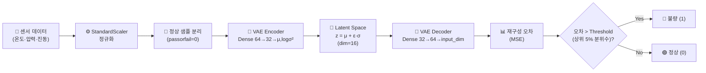

<div align="center">

# 🏭 KAMP 스마트제조 AI 경진대회 — VAE 기반 이상 탐지

**소성가공 공정 센서 데이터에서 제품 불량을 사전 탐지하는 비지도 학습 파이프라인**

[](https://www.python.org/)
[](https://www.tensorflow.org/)
[](https://keras.io/)
[](https://scikit-learn.org/)
[](https://pandas.pydata.org/)
[](https://numpy.org/)

`KAMP 스마트제조 AI 경진대회` · `2025.10` · `팀 프로젝트 보조`

</div>

---

## 📌 Key Highlights

| | |
|:---|:---|
| 🎯 **접근 방식** | 불량 레이블 없이 정상 데이터만으로 학습하는 VAE(Variational Autoencoder) 기반 비지도 이상 탐지 |
| 🔧 **핵심 기여** | EDA · 전처리 파이프 압축 · VAE 실험 코드 작성 보조 |
| 📊 **임계값 전략** | 정상 데이터 재구성 오차 분포의 상위 5% 분위수 → Threshold |
| 📈 **평가 지표** | F1-score (정상/불량 이진 분류) |

---

## 🔍 과제 정의

소성가공(금속 성형) 공정의 센서 데이터로 제품 불량을 사전에 탐지하는 AI 모델을 개발하는 과제입니다.

**핵심 제약 → 설계 결정:**

| 제약 | 영향 | 설계 결정 |
|:---|:---|:---|
| 불량 데이터 수집 비용이 높음 | 정상 데이터만 충분히 확보 가능 | **비지도 학습** (VAE) 채택 |
| 정상 ≫ 불량 (극심한 불균형) | 지도 학습은 다수 클래스 편향 | **재구성 오차 기반 탐지** |

---

## 🏗️ Architecture



---

## ⚙️ 모델 구조

| 구성 요소 | 설정 | 역할 |
|:---:|:---|:---|
| **Encoder** | Dense(64) → Dense(32) → μ, log_σ² | 잠재 분포 파라미터 압축 |
| **Latent** | dim=16, Reparameterization trick | z = μ + ε·σ (ε ~ N(0,1)) |
| **Decoder** | Dense(32) → Dense(64) → Dense(input_dim) | 잠재 벡터 → 원본 재구성 |
| **정규화** | ReLU + BatchNorm + Dropout(0.1~0.2) | 학습 안정성, 과적합 방지 |
| **Loss** | MSE(x, x̂) + β·KL(N(μ,σ²) ‖ N(0,I)) | 재구성 품질 + 분포 정규화 |

### 하이퍼파라미터 탐색

| 파라미터 | 탐색 범위 | 최적값 | 근거 |
|:---:|:---:|:---:|:---|
| Latent Dim | 8 / 16 / 32 | **16** | 8=정보 손실 과도, 32=일반화 부족 |
| Dropout | 0.1 / 0.3 / 0.5 | **0.1~0.2** | 높은 dropout → 재구성 품질 저하 |

---

## 🧠 핵심 기술 설계 로직

<details>
<summary><b>Reparameterization Trick</b> — 왜 필요한가?</summary>

> 잠재 변수 z를 μ + ε·σ (ε ~ N(0,1))로 표현하여, 샘플링 연산이 역전파를 차단하는 문제를 우회합니다. ε을 외부에서 샘플링하고 μ, σ만 학습 파라미터로 유지하여 기울기 계산이 가능합니다.
</details>

<details>
<summary><b>KL Divergence 정규화</b> — 왜 필요한가?</summary>

> KL 항은 잠재 분포 q(z|x)가 사전 분포 N(0,I)에서 크게 벗어나지 않도록 제약합니다. 이 제약이 없으면 모델이 각 샘플을 잠재 공간의 분리된 점으로 매핑하여, 연속적인 분포 학습이 불가능해집니다.
</details>

<details>
<summary><b>비지도 학습 vs 지도 학습</b> — 왜 VAE를 선택했나?</summary>

> 지도 학습 분류기는 불균형 데이터에서 다수 클래스(정상)만 예측하도록 편향됩니다. VAE는 레이블 없이 정상 분포만 학습하므로, 불량 샘플 수에 관계없이 일관된 탐지 기준을 제공합니다.
</details>

<details>
<summary><b>StandardScaler</b> — 왜 필요한가?</summary>

> 제조 센서 데이터는 온도(수백 ℃), 압력(수십 MPa), 진동(수 mm/s) 등 스케일이 극도로 다릅니다. 정규화 없이 학습하면 스케일이 큰 피처가 재구성 오차를 지배합니다.
</details>

---

## 📁 프로젝트 구조

```
KAMP/
├── 완성코드&자료/
│   ├── 00.ipynb                          # EDA (담당 파트)
│   ├── vae_analysis.ipynb                # VAE 이상 탐지 실험
│   └── kamp_경진대회_20251028_v0.1.pptx  # 팀 발표 자료
├── etc/
│   ├── EDA.ipynb                         # 초기 EDA
│   └── Guidebook_*.pdf
├── 데이터/
│   └── 소성가공 품질보증 AI 데이터셋.csv  # 메인 데이터
└── repo/
    ├── notebooks/vae_analysis.ipynb      # 공개 실험 코드
    └── README.md
```

---

## 📎 References

| | |
|:---|:---|
| 🏭 | [KAMP 스마트제조 플랫폼](https://www.kamp-ai.kr/) |
| 📄 | [VAE 논문 — Kingma & Welling (2013)](https://arxiv.org/abs/1312.6114) |
| 📚 | [TensorFlow VAE 튜토리얼](https://www.tensorflow.org/tutorials/generative/cvae) |
